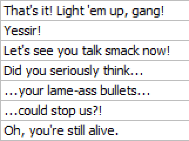

# Editing Guidelines

!!! warning "Stub"
    This page is a [stub][wikipedia-stubs].
    You can help by [expanding it][contributing].

    ??? question "How can I help?"
        You can help by expanding upon examples given in this document.
        Examples should ideally be real-life examples from real releases.

!!! danger "Editing Bible"
    This document is not the Bible,
    regardless of how authoritative it may sound in some sections.
    Editing is a creative process,
    and there are infinitely many schools of thought on how to best adapt a script.
    This document is simply a style guide to help maintain a somewhat consistent style to Kaleido releases.

!!! warning "Target Language"
    This document is written for an English-speaking audience.
    If you are not editing in English,
    a lot of the practices here may not apply to you.
    Always make sure to refer to widely-accepted style guides
    in the language you are editing in.

Editing plays a crucial role in fansubbing,
helping to make the original text more accessible
and ensuring the intended message is effectively conveyed.
This process can involve various changes,
such as adapting cultural references, rewriting jokes,
or making the dialogue flow more naturally.
There are many different opinions on what makes for good editing,
and many different editing styles to choose from.

This document is a style guide most Kaleido projects follow,
and is intended to provide a consistent style and quality of editing to the group's releases.
Deviations from these guidelines are often intentional,
and may help give more character to a subtitle
or fit the style of the original script better.

How close to this style guide scripts follow
depends on the script and the editor in charge of the project,
but the majority of Kaleido releases
should more or less follow this style guide.

## Grammar and Punctuation

Using proper grammar and punctuation is crucial for creating clear and engaging subtitles.
But there are also some other things to keep in mind,
such as the dialect of English to use.
In the subtitling community,
American English is the standard,
but some groups such as Kaleido use British English for its subtitles.

!!! Note "Consistency"
    British English is more flexible in which spellings you can use,
    as it's not uncommon for both spellings to be commonly accepted.
    However,
    you should strive to keep your spelling consistent throughout the project.

Below is a quick overview of some common differences between British and American English.

!!! example "Differences between British and American English"

    === "-ise/-ize"

        !!! Note "Spelling differences"
            British English spellings often end in "-ise",
            while American English uses "-ize":
            The spelling "-ize" is also often accepted in British English,
            but required in American English.

         | British English              | American English             |
         |------------------------------|------------------------------|
         | Fantasise                    | Fantasize                    |
         | Apologise                    | Apologize                    |
         | Recognise                    | Recognize                    |
         | Realise, Realisation         | Realize, Realization         |
         | Organise, Organisation       | Organize, Organization       |
         | Customise, Customisation     | Customize, Customization     |

    === "ou/o"

        !!! Note "Spelling differences"
            British English often uses "ou" where American English uses "o":

         | British English | American English |
         |-----------------|-------------------|
         | Colour          | Color             |
         | Favourite       | Favorite          |
         | Rumour          | Rumor             |
         | Neighbour       | Neighbor          |
         | Labour          | Labor             |

    === "-re/-er"

        !!! Note "Spelling differences"
            British English often ends words with "-re" while American English uses "-er":

         | British English | American English |
         |-----------------|-------------------|
         | Centre          | Center            |
         | Theatre         | Theater[^theatre] |
         | Metre           | Meter             |
         | Calibre         | Caliber           |
         | Fibre           | Fiber             |
         | Litre           | Liter             |

    === "ll/l"

        !!! Note "Spelling differences"
            British English often doubles the "l" where American English uses a single "l":

         | British English | American English |
         |-----------------|-------------------|
         | Travelling     | Traveling         |
         | Fuelling       | Fueling           |
         | Cancelled      | Canceled          |
         | Marvelling     | Marveling         |
         | Signalling     | Signaling         |
         | Labelling      | Labeling          |

    === "-ce/-se"

        !!! Note "Spelling differences"
            British English often uses "-ce" where American English uses "-se":

         | British English                     | American English                    |
         |--------------------------------------|--------------------------------------|
         | Defence                              | Defense                              |
         | Offence                              | Offense                              |
         | Licence                              | License                              |
         | Pretence                             | Pretense                             |
         | Practise (verb), Practice (noun)     | Practice (both verb and noun)        |
         | Advice (noun), Advise (verb)         | Advice (noun), Advise (verb)         |

    === "Other words"

         | British English                                | American English        |
         |------------------------------------------------|-------------------------|
         | Enrol                                          | Enroll                  |
         | Programme (TV and radio), Program (computer)   | Program (all uses)      |
         | Jewellery                                      | Jewelry                 |
         | Plough                                         | Plow                    |
         | Aluminium                                      | Aluminum                |
         | Draught                                        | Draft                   |
         | Tyre                                           | Tire                    |
         | Sceptical                                      | Skeptical               |
         | Ageing                                         | Aging                   |
         | Cosy                                           | Cozy                    |
         | Maths                                          | Math                    |
         | Lorry                                          | Truck                   |
         | Lift                                           | Elevator                |

Besides dialect differences,
there are a couple other "rules" Kaleido follows:

!!! example "Other rules"

    === "All right/Alright"

         "Alright" is almost always spelled as "all right".

         This is the accepted spelling in published writing,
         and is also the spelling we stick to.
         While cases can be made for "alright",
         it is always safer to use our preferred spelling.

         How closely the editor sticks to this rule
         is up to their discretion,
         and there's nothing essentially wrong with using "alright",
         so long as it's not used as a blank stand-in.

    === "OK/Okay"

         "OK" and "Ok" should almost always be fully spelled out as "okay".

         This is strictly for aesthetic reasons,
         and ultimately they mean the same thing.
         If there's an "OK" signage on screen,
         it may be appropriate to keep the abbreviation in dialogue as well,
         but in almost any other case,
         "okay" is preferred.

### Punctuation

Proper use of punctuation is almost always required.
Do not rely on punctuation used in the original Japanese script,
as punctuation rules and styles vary greatly between languages.

!!! example "Punctuation rules"
    === "Comma splices"

        Avoid comma splices.
        This is when multiple independent clauses are joined together with commas
        without any other punctuation to separate them.
        These often result in run-on sentences,
        which can be more difficult to read.

        !!! failure "Incorrect"
            "I love editing, it's my favorite hobby."

        Instead, use appropriate punctuation or conjunctions:

        !!! success "Correct"
            - "I love editing. It's my favorite hobby."
            - "I love editing, and it's my favorite hobby."

    === "Oxford comma"

        The Oxford comma is highly preferred.
        This will typically reduce ambiguity,
        but [not always](https://www.scribbr.com/commas/oxford-comma/#appositives).

        If you are unsure if an Oxford comma will help,
        it may be indicative that a line should be rewritten.

        === "Adding clarity"
            !!! failure "Incorrect"
                "I dedicate this book to my parents, Ayn Rand and God."

            !!! success "Correct"
                "I dedicate this book to my parents, Ayn Rand, and God."

            The Oxford comma clarifies that "parents", "Ayn Rand", and "God" are separate entities.

        === "Preventing misunderstanding"
            !!! failure "Incorrect"
                "We invited the strippers, JFK and Stalin."

            !!! success "Correct"
                "We invited the strippers, JFK, and Stalin."

            The Oxford comma makes it clear that JFK and Stalin are not the strippers.

        === "When to rewrite"
            Sometimes, even with an Oxford comma, a sentence can be ambiguous:

            !!! quote "Ambiguous Sentence"
                "I saw the elephant, my sister, and her husband at the zoo."

            This could be read in two ways:

            - That you saw the elephant, your sister, and her husband at the zoo.
            - That your sister is an elephant, and you saw her with her husband.

            In such cases, it's better to rewrite the line to remove the ambiguity.

            !!! success "Rewritten"
                "At the zoo, I saw an elephant. I also met my sister and her husband there."

        === "Simplifying complex lists"
            Consider this sentence with an Oxford comma:

            !!! quote "Example Sentence"
                "The menu includes fish and chips, macaroni and cheese, and peanut butter and jelly."

            While technically correct, this can be hard to read.
            Instead, consider rewriting the line so it's easier to understand:

            !!! success "Rewritten"

                - "The menu includes three items: fish and chips, macaroni and cheese, and peanut butter and jelly."
                - "The menu offers three classic pairings: fish with chips, macaroni with cheese, and peanut butter with jelly."

    === "Abrupt ends"

        Use em dashes (—) for interruptions or abrupt changes in thought,
        not hyphens (-) or double hyphens (--).

        !!! failure "Incorrect"
            "I'm sorry, I'm sorry, I'm s--"

        !!! success "Correct"
            "I'm sorry, I'm sorry, I'm s—"

        In the case of trailing off,
        ellipses (...) may be used.
        However, also consider whether a full stop (.) would be more appropriate.

        !!! success "Correct"
            - "I don't know..."
            - "I don't know."

    === "Ellipses spam"

        Avoid ellipses like the plague.

        Permit me to be so brazen as to break character and put my full hatred on display here
        (_we will continue with regular programming shortly_),
        but ellipses are almost always unnecessary,
        annoying to read,
        and can usually be replaced with different punctuation.

        Spamming them every time the character has even a _slight_ pause
        is not only annoying,
        but may also give the viewer the wrong impression
        about the character and the conviction put into the line,
        and in the worst cases feels like you're positioning a speed bump
        in front of the viewer while they're trying to read.

        The ellipsis has been abused by many scripts,
        especially in the 2000s.
        Thankfully,
        many editors have started to catch on to this,
        and it is becoming less common.

        Do not take this to mean that you should never use ellipses.
        They can be fantastic tools if used sparingly to convey doubt or uncertainty,
        or a character's trailing train of thought.
        However, not every pause merits an ellipsis,
        and they should absolutely _not_ be placed at the start and end
        of every single incomplete line (looking at you, [a.f.k.])

        !!! failure "Bad use of ellipses (thanks, [a.f.k.])"
             

        Always consider whether a full stop or even a comma would be more appropriate,
        or if a line even needs punctuation at all
        (such as with broken lines that continue immediately after,
        as is the case with almost every single line in the above example).
        Sometimes a line can be rewritten to convey the intended meaning more clearly
        without forcefully inserting an ellipsis.

        Naturally, in places where ellipses are required
        (such as when a character continues another character's line),
        they are completely fine to use.

        !!! success "Good use of ellipses"
             

        _Also, never use the four-dotted ellipsis._

    === "Japanese punctuation"

        It's not uncommon for Japanese punctuation
        to slip into English scripts by accident,
        especially in the past.
        You should stay on the lookout for these,
        and replace them with appropriate English punctuation where necessary.
        Similarly,
        you should try to avoid being beholden to the original punctuation,
        as the rules differ between English and Japanese.

        Examples of this include:

        - Banginterros (!?)

        In English, it's standard to use interrobangs (?!) to convey surprise and shock,
        whereas in Japanese banginterros (!?) are used instead.
        While banginterros are occasionally found in English,
        they are less standardised.

        - Wavy Dashes (~)

        In Japanese, the wavy dash (~) is often used to indicate a prolonged sound (like "Aah~").
        This is not used in English,
        and should be avoided.

        - Long dashes (――――――)

        These serve a similar purposes to em dashes,
        but can become rather extreme in use
        (admittedly, these are more often found in visual novels than subtitles).
        These should be replaced with appropriate punctuation,
        which depends on the context they are used in.

        - Quote brackets (「 」)

        While these brackets look cool,
        they are not used in English.
        These signify quotes in Japanese,
        and should be replaced with appropriate quotation marks.

### Quotation Marks

The use of quotation marks varies between British and American English,

!!! example "Differences between British and American English"

    === "Shared rules"

        The rules between British and American English are very similar.
        The following rule is shared by both:

        -   Double quotation marks are used when quoting,
        and single marks are used when quoting within quotes.

        !!! failure "Incorrect"
            The note said, "Exactly how long is "a few hours"?"

        !!! success "Correct"
            The note said, "Exactly how long is 'a few hours'?"

        -   Exclamation and question marks are placed inside the quotation marks if they are part of the quoted material,
        otherwise they are placed outside.

        !!! failure "Incorrect"
            I believe I heard her say "Are we there yet"?

        !!! success "Correct"
            I believe I heard her say "Are we there yet?"

    === "British English"

        -   If the punctuation is part of the quoted material,
        it goes inside the quotation marks.
        If not,
        it goes outside.

        !!! failure "Incorrect"
            She said, "I expect you to be home by midnight."

        !!! success "Correct"
            She said, "I expect you to be home by midnight".

    === "American English"

        -   Periods and commas are always placed inside the quotation marks,
        even if they are not part of the original quoted material.

        !!! failure "Incorrect"
            When I asked him if he wanted another piece of cake, he replied, "Yes".

        !!! success "Correct"
            When I asked him if he wanted another piece of cake, he replied, "Yes."

### Sentence structure

Dialogue flow is one of the things Kaleido editors focus on most.
Subtitles are timed to fit the dialogue,
and as such,
it's important to make it as easy as possible for the viewer to understand in a short amount of time
while flowing naturally.

!!! example "Sentence Structure"
    === "Splitting"

        Sentences should be broken up into smaller clauses where reasonable and natural.

        !!! failure "Long and complex"
            "The ancient castle, which had stood for centuries
            on the hilltop overlooking the village,
            was finally being restored to its former glory
            after years of neglect and decay."

        !!! success "Split into smaller clauses"
            "The ancient castle stood on the hilltop overlooking the village.
            It had been there for centuries.
            After years of neglect and decay,
            it was finally being restored to its former glory."

        Splitting clauses makes it easier for viewer to process individual pieces of information.

    === "Conciseness"

        Aim for concise sentences that convey information efficiently.
        This is especially important with subtitles,
        as viewers have limited time to read each line.

        !!! failure "Wordy"
            "Due to the fact that it was raining heavily, we decided to cancel our plans for a picnic in the park."

        !!! success "Concise"
            "We cancelled our picnic because of the heavy rain."

        Sentences can be wordier if the CPS is low,
        as there's more time for the viewer to read each line.
        Lines may also be extended sometimes,
        as it's a bit confusing to have a single, short line
        that takes up a lot of screen time.
        This gives the viewer the wrong impression
        that a lot of information is being cut.

    === "Clarity"

        Ambiguity should be avoided,
        unless the original script calls for it.
        If it's unclear what the intended meaning is,
        it may require some rewriting to make it clearer,
        even if it means inventing new information.

        !!! failure "Ambiguous"
            "She saw the man with the telescope."

        !!! success "Clear"
            - "She peeked through her telescope, and saw the man."
            - "She saw the man holding tightly to his telescope."

    === "Japaneseisms"

        These are common "Japaneseisms",
        or patterns common in Japanese-to-English translations,
        that should be avoided.

        === "Rearranging information"

            English and Japanese have different grammatical structures,
            which often requires rearranging information within a sentence for natural-sounding English.

            Prioritizing the viewer's comprehension is key,
            even if it means sacrificing minor details from the original.

            !!! failure "Incorrect"
                "Damn, being that bulletproof and with a blade that sharp, what do we do?"

            !!! success "Correct"
                "What can we even do against someone that's bulletproof _and_ has a blade that sharp?"

        === "Set phrases or grammar"

            Japanese often uses set phrases or grammatical structures
            that sound unnatural when directly translated.
            These should be rewritten to capture the intended meaning
            while sounding more natural to an English audience.

            Naturally,
            how you rewrite these depends entirely on the original line,
            the character speaking,
            and the context they are speaking in.

            !!! failure "Incorrect"
                "What's with your expression? An expression resembling a main protagonist filled with courage."

            !!! success "Correct"
                "The heck? Why are you looking at me like some hero ready to take on the final boss?"

            In some cases,
            equivalent English set phrases may exist for the given context.
            A common example of this is "Somebody!" vs. "Help me!".

        === "Awkward repetition"

            Avoid awkward repetition whenever possible.
            This is common in Japanese,
            but not in English.

            !!! failure "Incorrect"
                "Yeah, all right, all right."

            !!! success "Correct"
                "Yeah, whatever."

            

            !!! failure "Incorrect"
                "I'm kidding, I'm kidding! Have a look, have a look!"

            !!! success "Correct"
                "I'm kidding. Have a look!"

        === "Explicitness"

            Japanese often relies on vague or implied context,
            while English favours concreteness and explicitness.
            When editing,
            you should strive to make the intended meaning as clear as possible,
            even if it means adding additional information,
            or in rare cases even omitting some.

            === "Implied subject/pronouns"

                Japanese often omits the subjects or pronouns,
                assuming the reader will understand from context.
                In English, it's confusing if the subject is omitted,
                so it should be added in the translation.

            === "Ambiguous"

                Japanese sentences can sometimes leave certain elements
                like the time or actor implicit,
                and depends a lot more on context than English.
                In English,
                these elements should be made more explicit if possible
                to avoid confusion.

                !!! failure "Incorrect"
                    "He's going to his brother's house to meet his wife."

                !!! success "Correct"
                    "He's going to his brother's house to meet his brother's wife."

                

                !!! failure "Incorrect"
                    "The document was delivered, and now it's being reviewed."

                !!! success "Correct"
                    "The team delivered the document, and now the manager is reviewing it."

            === "Passive voice"

                Japanese often uses passive constructions,
                whereas English favours active voice.
                Keeping lines in passive voice can sound unnatural or vague,
                and sometimes even stilted.

                !!! failure "Incorrect"
                    "It is said that the castle was built by the king."

                !!! success "Correct"
                    "People say the king built the castle."

            === "Overly polite"

                Japanese often uses polite or indirect expressions,
                especially when asking questions or making suggestions.
                In English however, direct communication is preferred,
                and indirectness can sound awkward or overly formal.

                !!! failure "Incorrect"
                    "Would it be okay if I asked you to help with this?"

                !!! success "Correct"
                    "Could you help me with this?"

        === "Names"

            === "Direct address"

                It's common for Japanese to use a character's name in dialogue
                when referring to them in the third person,
                even when that character is the person being spoken to.
                This sounds unnatural in English,
                where we typically use pronouns like "you" instead.

                !!! warning "Stub"
                    This page is a [stub][wikipedia-stubs].
                    You can help by [expanding it][contributing].

                    ??? question "How can I help?"
                        Help me find the perfect example for this page.
                        I have some on the tip of my tongue, but I can't quite place them.

            === "Repeated use"

                Using a character's name repeatedly,
                especially in conversations where it's obvious who's being addressed,
                can feel overly formal or unnatural.

            === "Role terms"

                In Japanese, a person's role or relationship
                is often used in place of their name,
                such as "Onii-chan" for an elder brother,
                and "Sensei" for a teacher.
                This isn't anywhere near as common in English,
                and should be used sparingly if possible.

                !!! note "Older brother"
                    In English, we don't have a specific term for an elder brother,
                    and when a character is talking about their brother,
                    having no adjective implies they are older,
                    whereas "little" or "younger" more explicit signals they are younger.

            === "Name order"

                The Japanese name order is _Surname-First Name_,
                whereas in English it's _First Name-Surname_.

                There are many opinions on how to handle this,
                but Kaleido follows the _spoken order_.

    === "Run-on sentences"

        Try to avoid run-on sentences,
        as they are difficult to read and understand.
        If a sentence is too long,
        try to break it up into two shorter sentences.

        !!! failure "Incorrect"
            "The sun was setting, the birds were chirping, the flowers were blooming, it was a perfect spring evening."

        !!! success "Correct"
            "The sun was setting, birds were chirping, and flowers were blooming. It was a perfect spring evening."

        Exceptions may apply,
        such as when a character is speaking very quickly,
        or otherwise stumbling over their words.

        !!! success "Correct"
            "Oh god, I was literally just with him, and before I knew it he said something like, 'I'm doing it' and I was like, 'Do what?' and then he _jumped_ off the bridge!"

### Garden-pathing

Garden-pathing is when a sentence is easy to misinterpret when parsed sequentially,
and requires you to circle back to an earlier part of the sentence to understand it.
This is a common mistake made by English learners,
and should be avoided.

Below are a few examples of garden-pathing,
and how you may go about rewriting them[^gardenpath].

!!! example "Garden-pathing"
    === "Example A"

        !!! Quote "Example Sentence"
            "The horse raced past the barn fell."

        !!! abstract "Explanation"
            The reader initially assumes the horse is "racing past the barn",
            but the sentence actually means that the horse _was_ raced past the barn,
            and then it fell.

        !!! note "Rewritten"
            "The horse that was raced past the barn fell."

        !!! abstract "Explanation"
            Adding "that was" clarifies the relationship between the horse and the action of falling.

    === "Example B"

        !!! Quote "Example Sentence"
            "The man who hunts ducks out on weekends."

        !!! abstract "Explanation"
            The reader initially assumes the sentence means that the old man "hunts ducks (the birds) out on weekends",
            but "ducks out" is actually the verb "to duck out" (i.e. leave or avoid something).

        !!! note "Rewritten"
            "The man who hunts hides out on weekends."

        !!! abstract "Explanation"
            Changing the verb to "hides" makes it clear that the old man is trying to avoid something
            while avoiding the misunderstanding that he's hunting a specific animal on weekends.

    === "Example C"

        !!! Quote "Example Sentence"
            "The prime number few."

        !!! abstract "Explanation"
            The reader initially assumes that "the prime number" is the subject of the sentence,
            as in discussing a specific number (maths),
            but the sentence is actually referring to a small number of prime people.
            The "few" does not logically connect to "the prime number" when read sequentially.

        !!! note "Rewritten"
            - "The few prime individuals."
            - "The number of prime individuals is few."

        !!! abstract "Explanation"
            Adding "individuals" makes it clear that the sentence is referring to a group of people.

As illustrated above,
there are a variety of ways to rewrite sentences to avoid garden-pathing:

-   Adding clarifying words (such as "that", "which", or "who")
-   Changing the verb
-   Adding additional context
-   Splitting the sentence
-   Using active voice
-   Reordering the sentence
-   Eliminating unnecessary modifiers or adjectives
-   Using conjunctions ("and", "but", "or", "so", "for", etc.)

### Miscellaneous

Rules that don't fit in the other categories.

!!! example "Miscellaneous"

    === "Abbreviated titles"

        While Kaleido typically sticks to British English rules,
        there is one notable exception: abbreviated titles.
        We follow the American English convention,
        and use a full stop after the abbreviation.

        | British English | American English |
        | --------------- | ---------------- |
        | Mr              | Mr.              |
        | Dr              | Dr.              |
        | Mrs             | Mrs.             |
        | Ms              | Ms.              |

        However,
        keep the difference between "Ms.",
        "Miss",
        and "Ms" in mind.
        "Miss" is a respectful way to refer to an unmarried woman,
        "Mrs." is used for a married woman,
        and "Ms." is when you're unsure,
        and generally the safest choice.
        If a common joke is that a female teacher is unmarried,
        you should refer to her as "Miss" rather than "Ms.".
        If it's unknown to some characters
        and they wouldn't reasonably assume them to be married,
        they should use "Ms." and switch to "Mrs."
        if they find out later.

    === "Numbers"

        Numbers should be spelled out whenever reasonably possible,
        and if the characters-per-second (CPS) allows for it.

        | Number | Spelled Out             |
        | ------ | ----------------------- |
        | 36     | Thirty-six              |
        | 100    | One hundred / A hundred |
        | 991    | Nine hundred ninety-one |

        ??? Abstract "Chicago Manual of Style"
            The [Chicago Manual of Style](https://www.chicagomanualofstyle.org/) has the following rules for numbers:

            -   Spell out numbers one through one hundred.
            -   Spell out multiples of one through one hundred used in combination with hundred, thousand, 
                or hundred thousand.

            These are for written text so are not always applicable to subtitles,
            but they're generally good rules to follow.

        In some cases,
        certain numbers appear frequently in a show.
        These should ideally be handled consistently throughout the project,
        and be edited while considering how that may impact future lines.

        | Original                         | Avoid                                                            |
        | -------------------------------- | ---------------------------------------------------------------- |
        | "Stop right there, Misaka 9982!" | "Stop right there, Misaka nine-thousand-nine-hundred-eighty-two! |

    === "Dates"

        Dates should always be written in numeric form.

        | Date                       | Avoid                                               |
        | -------------------------- | --------------------------------------------------- |
        | 1st of January             | First of January                                    |
        | Oct. 2                     | October Second                                      |
        | The 25th of December, 1998 | The twenty-fifth of December, nineteen-ninety-eight |

## TODO: rest of this

## Characterisation

-   Maintaining character voice and personality
-   Handling honorifics and name suffixes
-   Proper use of profanity and explicit language
-   Regional dialects and accents, and the dangers thereof
-   Age-appropriate language

## Cultural Adaptation

-   Adapting cultural references for the target audience
-   Preserving the original cultural context
-   When to use each approach
-   Translating or adapting idioms and proverbs
-   Dealing with wordplay and puns

## Formatting

-   Line breaks and readability
-   Italics and emphasis
-   Off-screen dialogue
-   "Safe" tags
-   Etc.

## Other Things of Note

[^theatre]: In some cases, "theatre" may still be used in American English, where a "theat*re*" is a venue you visit to watch plays, and "theat*er*" is the performance-driven art form.
[^gardenpath]: Most of these examples are taken from [this paper](https://pdfs.semanticscholar.org/260d/3b53b1376b5cd30881bbd3ce2472af507adc.pdf).

[//]: # (stubs)
[contributing]: https://github.com/Jaded-Encoding-Thaumaturgy/JET-Guide?tab=readme-ov-file#contributing
[wikipedia-stubs]: https://en.wikipedia.org/wiki/Wikipedia:Stubs
